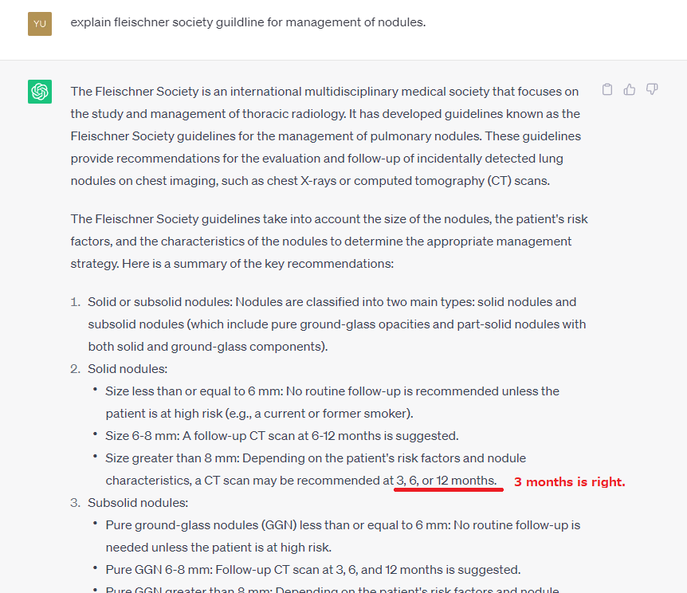
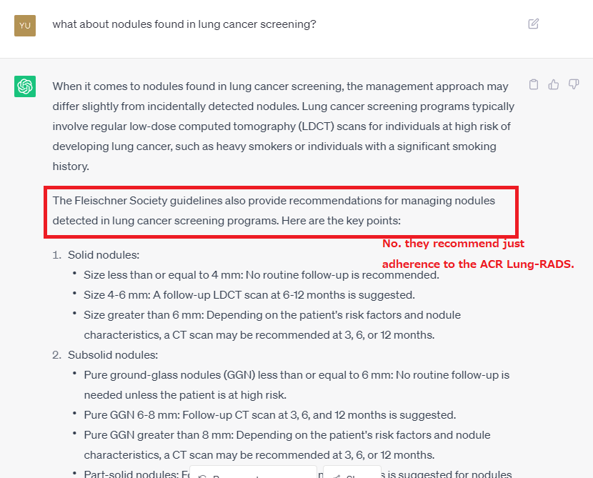

# All About Guidelines
 
Since AI chat model seems to have reasonable understanding of medical terminology, we think it can be seriously considered for use in the medical field.
However, there are several problems with using the chat tool in a medical. 
  
 
## Hallucination
#### Mistake in detail
The problem of Hallucination is serious.
Hallucination is a problem that chat AI responds plausibly with false information.
For example, ask about the content of Fleischner's guidelines.
We’ve got a very specific and detailed response as shown here. 

However, it was found there were some details thought to be a bit mistake.
For example, the Fleischner’s guidelines clearly state that follow-up CT scan is after 3 months for solid nodules larger than 8 mm, but the response was 3,6,12 months.

#### Completely fake
Sequentially asked about nodules found in lung cancer screening. 

It answered that Fleischner Society has recommendations in their guidelines for nodules detected in lung cancer screening programs. 
But they don’t. They only recommends adherence to the ACR Lang-RADS. 
So, Chat AI’s answer was all fake. 

## All About Guideline Demo
Using the following repositories and resource, we made guildline referencing chat tool. 
- <a href="https://github.com/lm-sys/FastChat" target="_blank">lm-sys/FastChat</a>
- <a href="https://github.com/hwchase17/langchain" target="_blank">hwchase17/langchain</a>
- <a href="https://pubs.rsna.org/doi/full/10.1148/radiol.2017161659" target="_blank">Guidelines for Management of Incidental Pulmonary Nodules Detected on CT Images: From the Fleischner Society 2017</a>

### Demo
 

